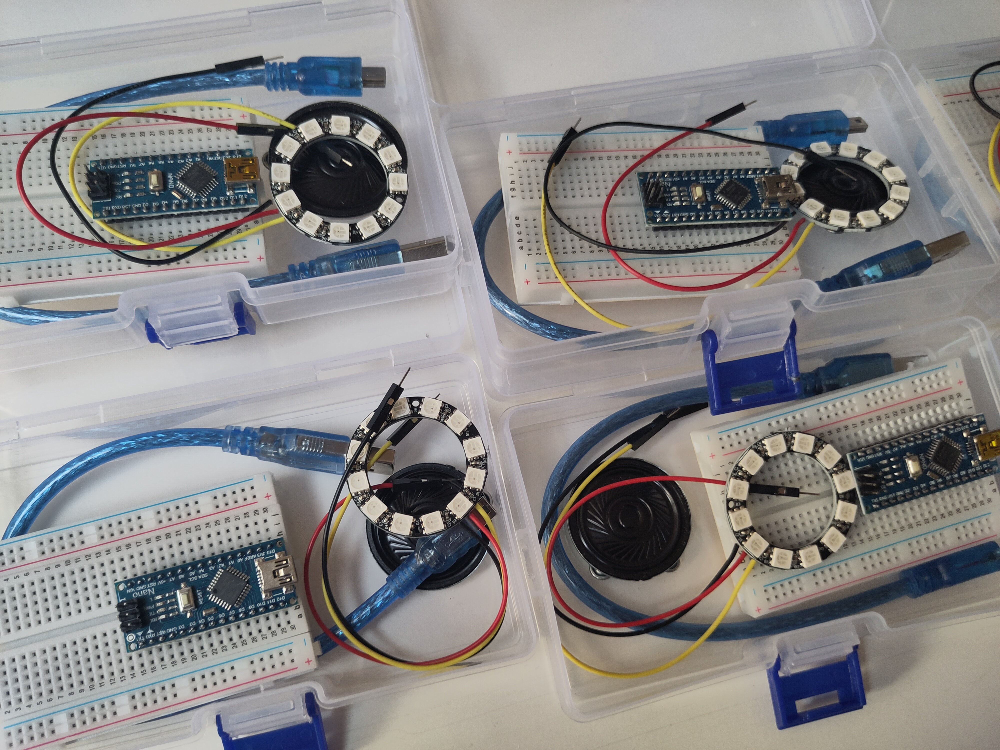
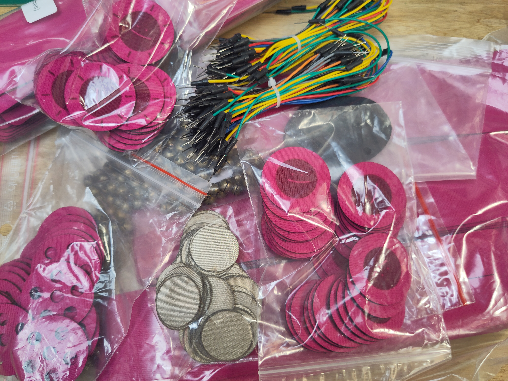
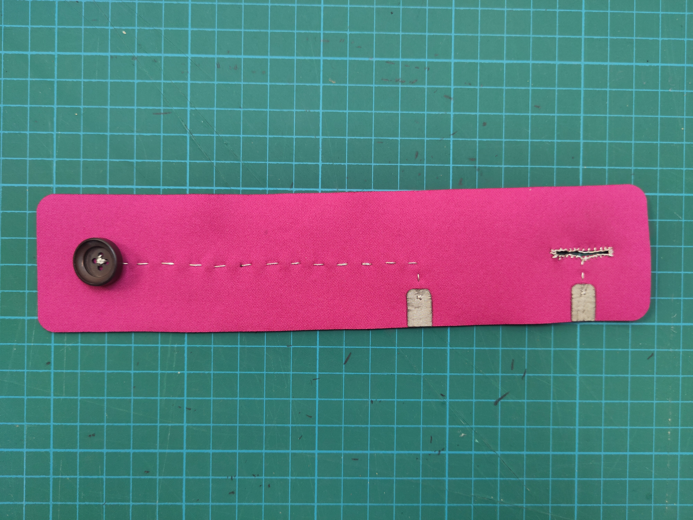

This is the documentation for a workshop of introduction to eTextile.

You will find in this repository [a serie of tutorial](https://github.com/DataPaulette/WS-intro-DP-Etextile-2024/tree/main/sensor_tutorial) to create you own sensors

The [arduino code](https://github.com/DataPaulette/WS-intro-DP-Etextile-2024/tree/main/Arduino-code) to connect this sensors to actuators through an arduino board.

And [a schematic](https://github.com/DataPaulette/WS-intro-DP-Etextile-2024/blob/main/HowToConnectSensorToArduino.png) to see how to connect sensors to the arduino.

### Electronic kit

#### Content :
- Arduino (+ breadBoard)

- Ring neopixel WS2812

- Speaker 8ohm

- Jumper
- Alligator clip

### Textile kit

#### Sensors :
- On / Off sensor

- Pressure sensor

- Tilt sensor

- Switch button

