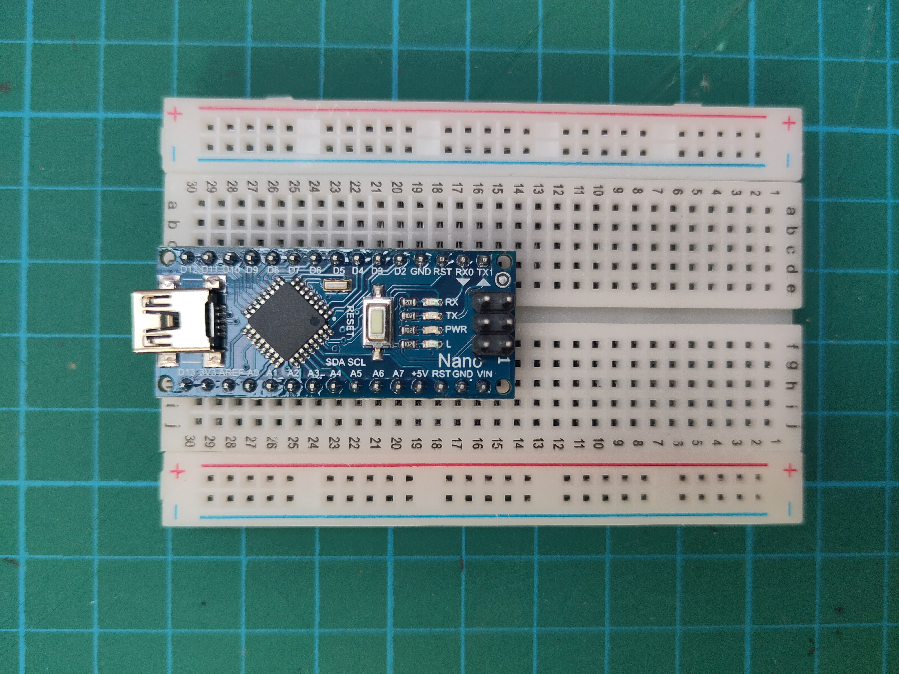
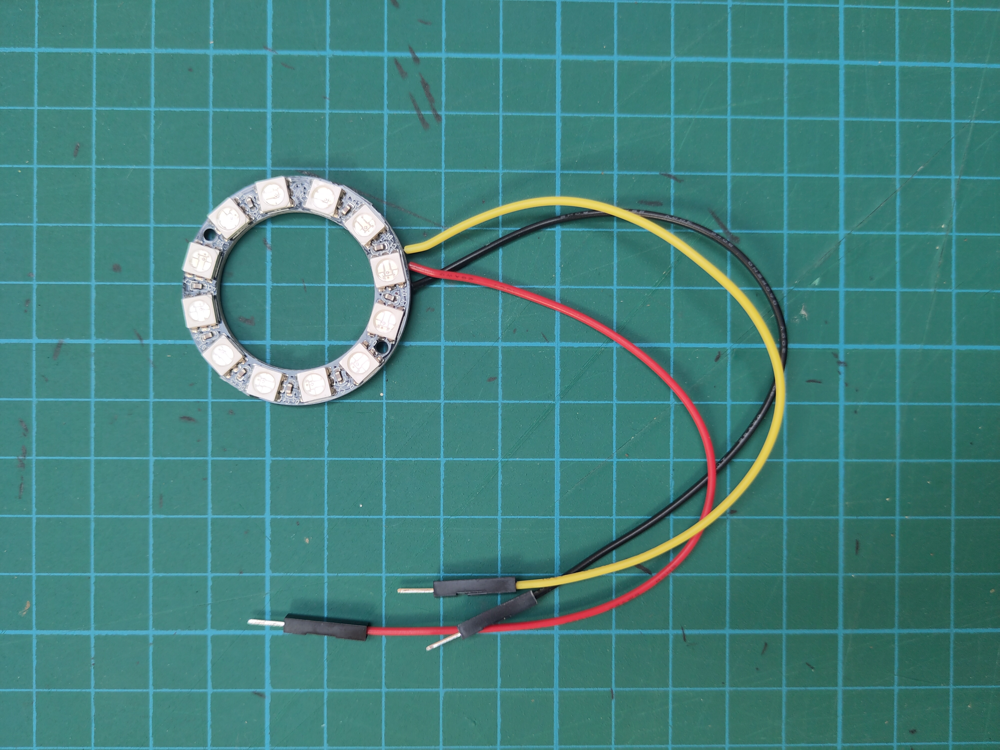
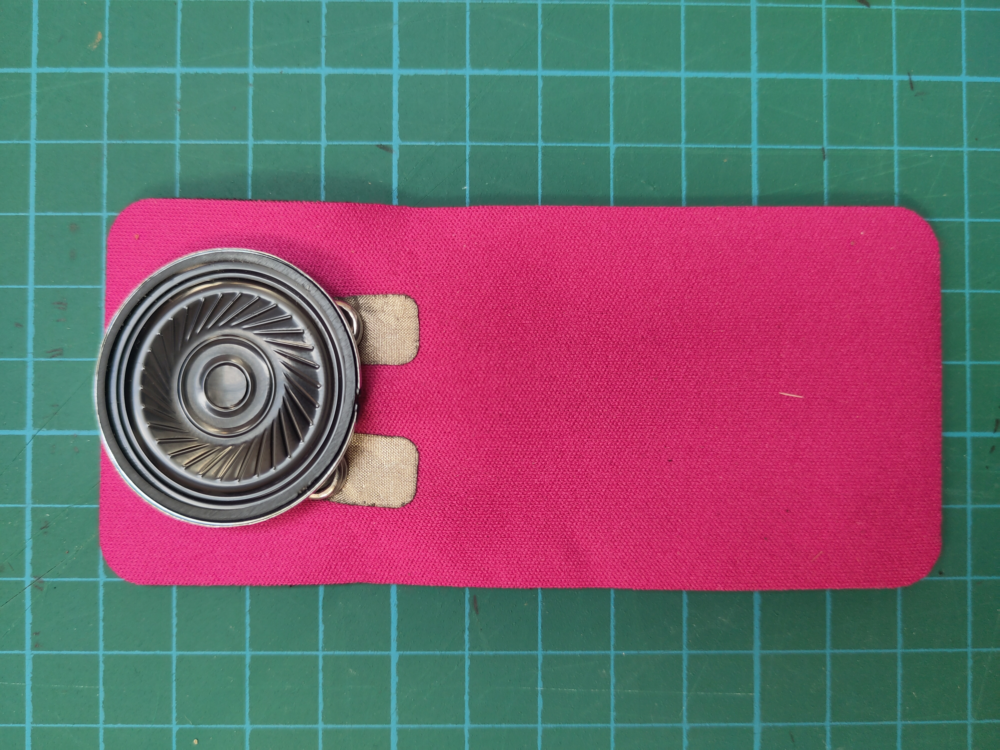
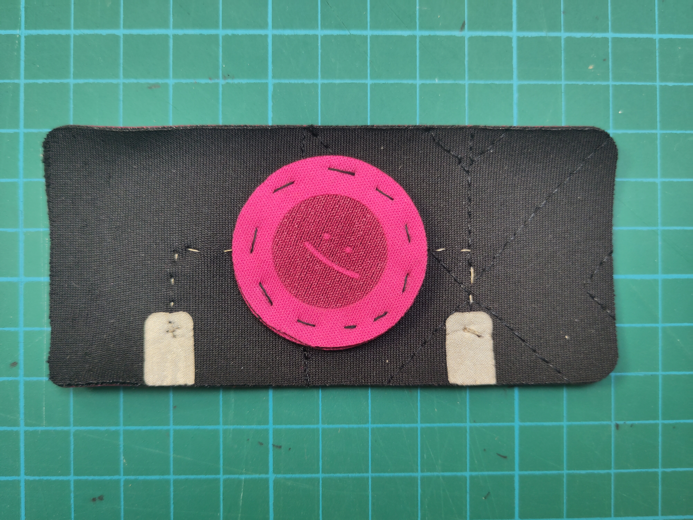
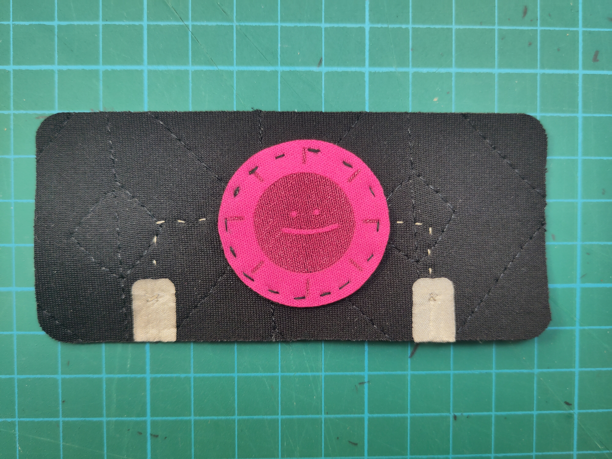

This documentation is provided for a workshop of introduction to eTextile given at [IFA](https://www.ifaparis.com/).

You will find in this repository an introduction to etextile through the work of DataPaulette.
[Presentation](https://github.com/DataPaulette/WS-IFA-2024/blob/main/Introduction-DP.pdf)
A serie of tutorial to create you own sensors

The arduino code to connect this sensors to actuators through an arduino board.

Material kit :
- Arduino (+ breadBoard)

- Ring neopixel WS2812

- Speaker 8ohm

- Jumper
- Alligator clip

Sensors :
- On / Off sensor

- Pressure sensor

- Tilt sensor

- Switch button

