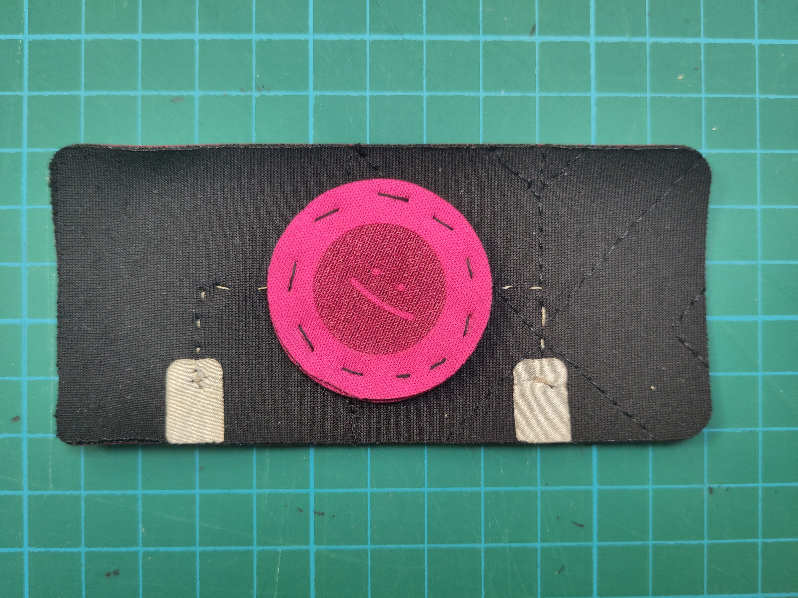

## On / Off sensor

### Material parts

1. Conductive pad to connect the sensor to the arduino board after.
2. Conductive pad for circles
3. In-between circle in neoprene
4. Top circle of the sensor
5. Back part of the sensor
6. Conductive thread

### Step by Step

--

--

--

--

--

--

--

