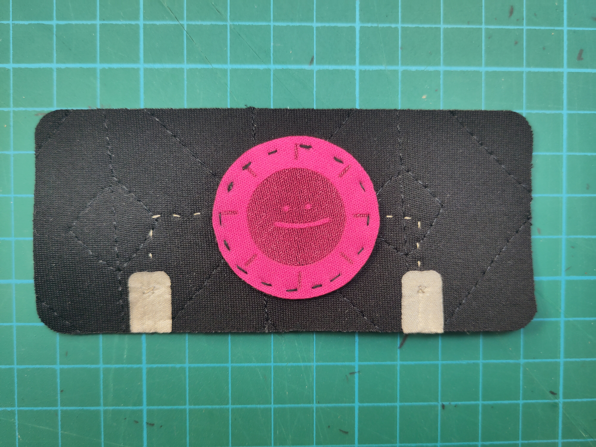
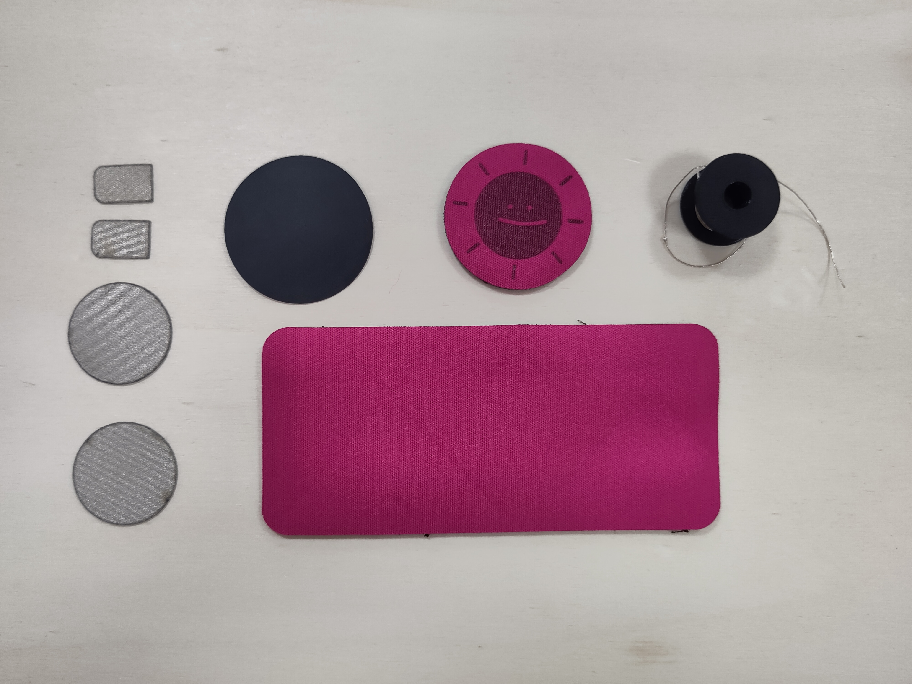

## Pressure sensor

### Material parts

1- Conductive pad to connect the sensor to the arduino board after.
2- Conductive pad for circles
3- In-between circle in neoprene
4- Top circle of the sensor
5- Back part of the sensor
6- Conductive thread

### Step by Step
